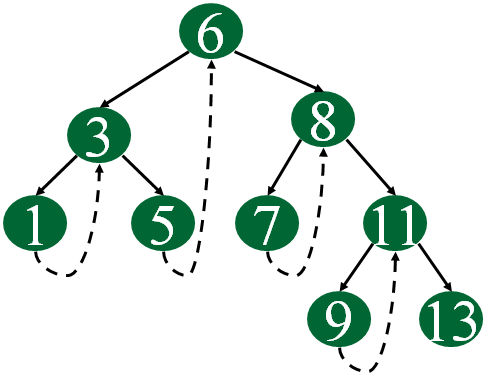

# 3.3 Dictionaries

## Main Operations
- Search
- Insert
- Delete
- Max/Min
- Predecessor/Successor

## Examples of Use
- Remove all duplicates
- Read through mailing list and search

## Implementation Differences: Sorted vs Unsorted Arrays

| Dictionary Operation | Unsorted Array | Sorted Array |
|---------------------|----------------|--------------|
| Search(L, k)        | O(n)           | O(log n)     |
| Insert(L, x)        | O(1)           | O(n)         |
| Delete(L, x)        | O(1)*          | O(n)         |
| Successor(L, x)     | O(n)           | O(1)         |
| Predecessor(L, x)   | O(n)           | O(1)         |
| Minimum(L)          | O(n)           | O(1)         |
| Maximum(L)          | O(n)           | O(1)         |

### Key Points
- **Search**: Takes linear time in the worst case for unsorted arrays (when key is not found)
- **Insertion**: Constant time for unsorted arrays since the array remains untouched; O(n) time for sorted arrays due to resorting requirement
- **Deletion**: Constant time in unsorted arrays using a trick - move the last element to the position being deleted and decrement n

*Note: Delete operation assumes we're given a pointer to the element

## Implementation Differences: Singly vs Doubly Linked lists and sorted vs. unsorted order
| Dictionary operation | Singly unsorted | Double unsorted | Singly sorted | Doubly sorted |
|---------------------|-----------------|-----------------|---------------|---------------|
| Search(L, k)        | O(n)            | O(n)            | O(n)          | O(n)          |
| Insert(L, x)        | O(1)            | O(1)            | O(n)          | O(n)          |
| Delete(L, x)        | O(n)*           | O(1)            | O(n)*         | O(1)          |
| Successor(L, x)     | O(n)            | O(n)            | O(1)          | O(1)          |
| Predecessor(L, x)   | O(n)            | O(n)            | O(n)*         | O(1)          |
| Minimum(L)          | O(n)            | O(n)            | O(1)          | O(1)          |
| Maximum(L)          | O(n)            | O(n)            | O(1)*         | O(1)          | 

# 3.4 Binary Search Trees

## Core Concepts

- Binary search trees enable fast access to median elements and nodes below a given node
- Key property: all nodes to the left have keys < x, all nodes to the right have keys > x

## Structure

- Nodes contain:
  - Left and right pointer fields
  - Optional parent pointer
  - Data field

## Operations

- Basic operations:
  - Searching
  - Traversing
  - Insertion
  - Deletion
- All dictionary operations take O(h) time, where h is the height of the tree
  - Smallest possible height: h = log n (when tree is perfectly balanced)

## Challenges

- Insertion can lead to unbalanced trees
  - In worst case, the tree degenerates to a linked list
- Solution: randomization
  - Similar concept to quicksort (fastest known sorting algorithm)

## Balanced Search Trees

- Adjust tree slightly after each insertion
- Guarantee maximum height is logarithmic
- All dictionary operations take O(log n) time
- Implementations include:
  - Red-black trees
  - Splay trees

## Threaded Binary Tree
  - inorder traversal of binary trees without using recursion or the stack
  - A binary tree is made threaded by making all right child pointers that would normally be NULL point to the inorder sucessor of the node if it exists
  - useful when space is a concern, as it eliminated the need for a stack during reversal
  - Influences algorithms like Morris Traversal

  

# 3.5 Priority Queues

## Core Concepts

- Data structures more flexible than simple sorting
- Allow new elements to enter a system at arbitrary intervals
- More cost-effective than resorting everything on each arrival

## Primary Operations

- **Insert**: Add an item with key k into priority queue Q
- **Find Min/Max**: Return pointer to item with smallest/largest key
- **Delete Min/Max**: Remove item with minimum/maximum key

## Real-World Analogy

- Many natural processes follow priority queue model
- Example: Dating (extracting most desirable person from data structure)

## Time Complexity Comparison

### Unsorted Array
- **Insert**: O(1) - Add to end
- **Find Min/Max**: O(n) - Must scan entire array
- **Delete Min/Max**: O(n) - Find and remove

### Sorted Array
- **Insert**: O(n) - Must maintain order
- **Find Min/Max**: O(1) - First/last element
- **Delete Min/Max**: O(1) - When storing in reverse order, minimum is at tail

### Balanced Binary Search Tree
- **Insert**: O(log n)
- **Find Min/Max**: O(log n)
- **Delete Min/Max**: O(log n)

## Optimization Techniques

- Store extra pointer/index to minimum entry
- Update pointer on insertion if new value < current minimum
- After delete-minimum, perform "honest" find-minimum to restore pointer
  - Takes O(n) time on unsorted array
  - Takes O(log n) time on binary search tree

|                    | Unsorted array | Sorted array | Balanced tree |
|--------------------|----------------|--------------|---------------|
| Insert(Q, x)       | O(1)           | O(n)         | O(log n)      |
| Find-Minimum(Q)    | O(1)           | O(1)         | O(1)          |
| Delete-Minimum(Q)  | O(n)           | O(1)         | O(log n)      |

# War Story: Stripping Triangulations

## Problem
- There is a bottleneck when trying to represent structures as triangulated surfaces
- The bottleneck is often actually feeding the hardware engine the triangulation structure, since the hardware is pretty fast to begin with

## Approach
- Each triangle can be represented by specifying the three endpoints
- However, instead of specifying three endpoints, you can partition the triangles into strips of adjacent triangles
- Then just walk along the strip, since each triangle shares two vertices with its neighbors
- This way we save the cost of retransmitting two vertices

## Implementation
- Finding a small number of strips that cover each problem can be thought of as a graph problem
- The graph of interest has a vertex for every triangle in the mesh, and an edge between every pair of vertices representing adjacent triangles
- This is a dual graph representation and captures all the information about triangulation needed to partition it into triangular strips

## Algorithm
- Goal: Partition the vertices into as few paths or strips as possible
- Partitioning it into one path implies discovering a Hamiltonian Path (visits every vertex exactly once)
- Finding a Hamiltonian Path is an NP-complete problem
- For NP-complete problems, don't look for an optimal algorithm -- instead concentrate on finding heuristics

## The Simple Heuristic
- Start from an arbitrary triangle and do a left-right walk until the walk ends, either by hitting the boundary of the object or a previously visited triangle
- This is fast and simple, but there is no reason why it should find the smallest possible set of left-right strips for a given triangulation

## The Greedy Heuristic
- Always tries to grab the best possible thing first
- Identify the starting triangle that yields the longest left-right strip and peel that one off first
- This greedy heuristic does not guarantee the best possible solution, since the first strip you peel off might break apart a lot of potential strips we might've used later

## Optimizing the Greedy Approach
- Let k be the length of the walk possible from an average vertex
- Using the simplest possible implementation, we could walk from each of n vertices to find the largest remaining strip to report in O(kn) time
- Repeating this for each of the n/k strips would yield an O(n²) implementation
- This needs to be sped up
- It seems wasteful to rewalk from each triangle after deleting a strip
- We could maintain the lengths of all possible future strips in a data structure
- When we peel off a strip, we must update the lengths of all affected strips -- those strips will be shortened because they walked through a triangle that no longer exists

## Data Structure
- The data structure to use here is a Priority Queue
- We are repeatedly identifying the longest remaining strip
- Need a priority queue to store the strips ordered according to length
- The next strip to peel always sits at the top of the Queue
- All the strips were bounded by a fairly small integer (hardware constrains any strip from having more than 256 vertices)
- So we are using a bounded-height priority queue (an ordinary heap would have also worked fine)

## Results
- After this implementation, the greedy heuristic with priority queue data structure ran in O(n * k) time, where n is the number of triangles and k is the length of the average strip
- When working with large enough data sets, only linear and near-linear algorithms (O(n) or O(n log n)) are likely to be fast enough

# 3.7: Hashing and Strings

## Hash Tables for Dictionary Maintenance

- Hash tables are practical ways to maintain a dictionary
- Hash functions are mathematical functions that map keys to integers
- We then use the values of our hash function as an index into an array
- Need to prevent two keys from having the same values (collisions)

## Collision Resolution Methods

### Chaining
- Devotes a considerable amount of memory to pointers
- Each array position contains a linked list of all items hashing to that position

### Open Addressing
- Hash table is maintained as an array of elements, not buckets, each initialized to null
- On insertion, check if the desired position is empty:
  - If so, insert the element
  - If not, find another place

#### Sequential Probing
- Insert the element into the next available slot

## Operations in Open Addressing

### Searching
- Go to the appropriate hash value
- Check if the item there is the one we want:
  - If so, return it
  - If not, keep checking through the length of the run

### Deleting
- Can get complicated, since removing one element might break a chain of insertions
- This could make some elements inaccessible
- No alternative but to reinsert all the items in the run following the new hole

## Time Complexity

- Both chaining and open addressing require O(m) to initialize m element hash tables to null elements prior to the first insertion
- Traversing all elements in the hash table:
  - Chaining: O(n+m) time (must scan all m buckets looking for elements)
  - Open addressing: O(m) time (since n must be at most m)

## Conclusion

- A hash table is often the best data structure to maintain a dictionary

| Operation         | Hash table (expected)  | Hash table (worst case) |
|-------------------|------------------------|-------------------------|
| Search(L, k)      | O(n/m)                 | O(n)                    |
| Insert(L, x)      | O(1)                   | O(1)                    |
| Delete(L, x)      | O(1)                   | O(1)                    | 
| Successor(L, x)   | O(n + m)               | O(n + m)                |
| Predecessor(L, x) | O(n + m)               | O(n + m)                |
| Minimum(L)        | O(n + m)               | O(n + m)                |
| Maximum(L)        | O(n + m)               | O(n + m)                |

# 3.7.2: String Matching via Hashing

## String Basics
- Strings are sequences where the order matters
- The primary data structure for strings is an array of characters
- Allows for constant-time access to the ith character of the string
- Most fundamental operation on text strings is substring search

## Substring Search
- **Problem**: Substring Pattern Matching
- **Input**: A text string t and a pattern string p
- **Output**: Does t contain the pattern p as a substring, and if so where?

### Worst-Case Quadratic Bound
- Overlay the pattern string at every position in the text, and check whether every pattern character matches the corresponding text
- This runs in O(nm) time, where n = |t| and m = |p|

### Linear Expected Time: Rabin-Karp Algorithm
- Based on hashing -- specifically rolling hash technique
- Compute the given hash function on both:
  - Pattern string p
  - The m-character substring starting from the ith position of t
- If the two strings are identical, the resulting hash values must be the same
- If the two strings are different, the hash values will certainly be different
- False positives should be rare, so we can spend O(m) time to explicitly check the identity of two strings whenever the hash values agree
- Reduces string matching to n - m + 2 hash value computations (the n-m+1 windows of t, plus one hash of p), plus what should be a very small number of O(m) string comparisons

### Efficient Computation
- The catch is that it takes O(m) time to compute a hash function on an m-character string, and O(n) such computations leaves us with an O(nm) algorithm again
- However, for the hash function, once we know the hash value from the j position, we can find the hash value for the (j+1)st position for the cost of two multiplications, one addition, and one subtraction, which can be done in constant time

### Randomized Algorithm
- Rabin-Karp algorithm is a good example of a randomized algorithm
- If we pick M in some random way, we can get no guarantee that it runs in O(n + m) time
- But the odds of a false collision is 1/M if the hash function returns values uniformly from 0 to M-1

# 3.1: War Stories: String Em Up

## Problem
- DNA sequences are represented as strings of these four characters (A, C, T, G). These strings can be very long, approximately three billion pairs of characters long
- Big O analysis is fully justified here
- Proposed technique called sequencing by hybridizatoin (SBH)
  - attaches probes to an array, forming a sequencing chip
  - each of these probes determines whether or not the probe string occurs as a substring of the DNA target
### Identify all the strings of length 2k that are possible substrings of an unkown string S, given the set of all length k substrings of S
- Suppose we know AC, CA, CC are the only 2 length substrings of S
  - ACCA is possible, bot CAAC is not possible since AA is not a substring of S
- Need to find a fast algorithm to construct all the consistent length 2-k strings, since S could be very long
- First implementation: Binary search three
  - a bst could find the correct string with O(logn) comparisons, each comparison involving testing which of the two length-k strings appeared first. the total time using binary tree is O(k*logn)
  - this implementation takes forever on strings over 2000 characters
  - almost all the time was spent seraching in this data structure
  - since you're doing this k-1 times for each O(n^2) possible concatenations. 
  - Needed a faster dictionary data structure, since search was the innermost operation of the deep loop
- Second Implementation: Hash Tables 
  - it should take O(k) time to hash the k-character string and look it up in the table, which would knock off a factor of O(logn)
  - the program was still too slow
  - need a faster data structure to search in the dictionary of strings
  - What can be faster than a hash table?
    - To look up k-character strings, you must read all k characters and the dictionary already seraches in O(k)
    - it does take k comparisons to test the first substring, but we can do better on the second test. the strings differ from each other by one chracter when teting every other substring
    - Enter: Suffix Trees
  - Suffix Trees:
    - a suffix tree is a trie containing all the suffixes of a given set of strings
    - the suffixes of ACAC are {ACAC, CAC, AC, C}
  - Program runs out of memory now
- Third Implementation: 
  - Compressed suffix trees
  - they take linear space